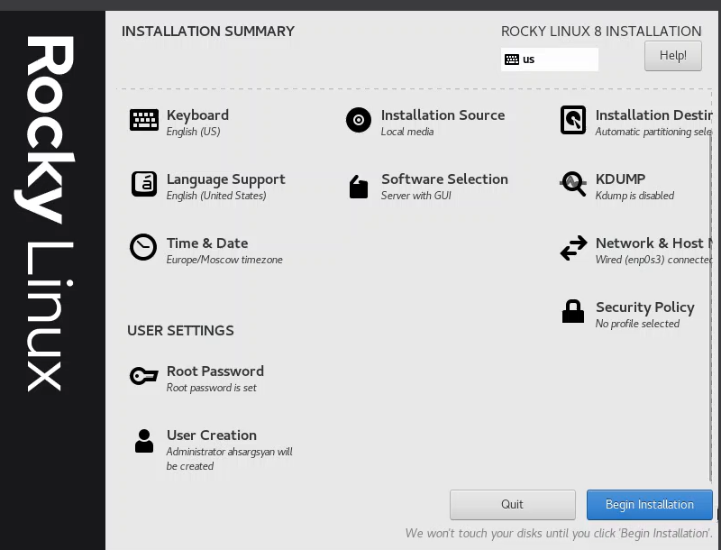
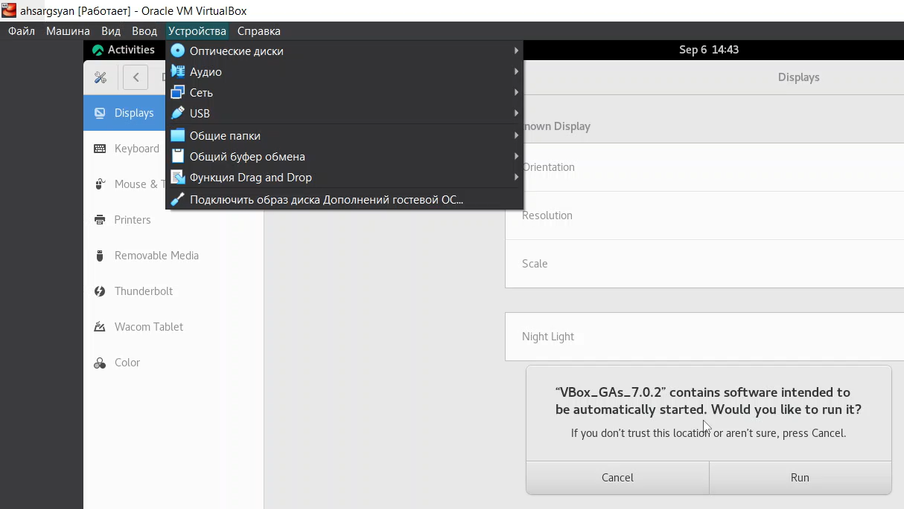
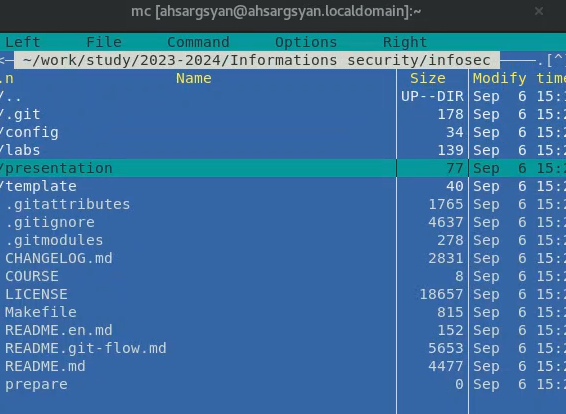
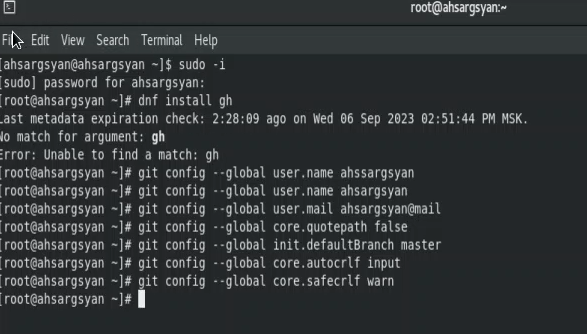

---
## Front matter
lang: ru-RU
title: Презентация лабораторной работы №1
subtitle: Первоначальная настройка оборудования
author:
  - Саргсян А. Г.
institute:
  - Российский университет дружбы народов, Москва, Россия
date: 19 мая 2003

## i18n babel
babel-lang: russian
babel-otherlangs: english

## Formatting pdf
toc: false
toc-title: Содержание
slide_level: 2
aspectratio: 169
section-titles: true
theme: metropolis
header-includes:
 - \metroset{progressbar=frametitle,sectionpage=progressbar,numbering=fraction}
 - '\makeatletter'
 - '\beamer@ignorenonframefalse'
 - '\makeatother'
---

# Цели и задачи работы

## Цель лабораторной работы

Первоначальная настройка оборудования для работы

## Задание к лабораторной работе

1. Установвить виртуальную машину.
2. Синхронизировать с репозиторием на github. 

# Процесс выполнения лабораторной работы

## Настройка ОС  

{ #fig:001 width=70% height=70% }

## Настройка ОС  

{ #fig:002 width=70% height=70% }

## Настройка git  

{ #fig:003 width=70% height=70% }

## Настройка git  

{ #fig:004 width=70% height=70% }

# Выводы по проделанной работе

Установили необходимое оборудование для дальнейшей работы.

