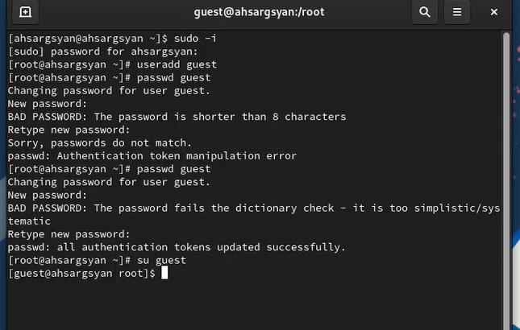
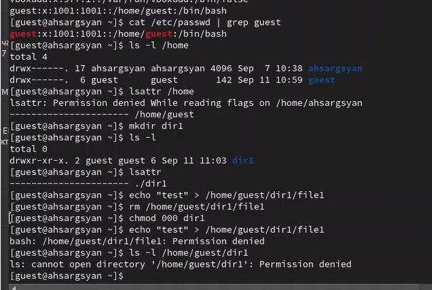

---
## Front matter
lang: ru-RU
title: Презентация лабораторной работы №2
subtitle: "Дискреционное разграничение прав в Linux. Основные атрибуты"
author:
  - Саргсян А. Г.
institute:
  - Российский университет дружбы народов, Москва, Россия
date: 14 сентября 2023

## i18n babel
babel-lang: russian
babel-otherlangs: english

## Formatting pdf
toc: false
toc-title: Содержание
slide_level: 2
aspectratio: 169
section-titles: true
theme: metropolis
header-includes:
 - \metroset{progressbar=frametitle,sectionpage=progressbar,numbering=fraction}
 - '\makeatletter'
 - '\beamer@ignorenonframefalse'
 - '\makeatother'
---

# Цели и задачи работы


Получение практических навыков работы в консоли с атрибутами файлов, закрепление теоретических основ дискреционного разграничения доступа в современных системах 
с открытым кодом на базе ОС Linux.


# Процесс выполнения лабораторной работы

## Теоретический материал 

1. Роли пользователей: В Linux существуют разные роли пользователей, такие как обычные пользователи, администраторы (суперпользователи), и другие пользовательские группы. Каждая роль имеет свои права и ограничения.

2. Права доступа: Права доступа к файлам и каталогам определяются для трех основных категорий пользователей: владельцев файла, группы и всех остальных. Эти права включают в себя чтение (r), запись (w) и выполнение (x).

3. Команды chmod и chown: Для изменения прав доступа и владельцев файлов и каталогов в Linux используются команды chmod и chown. chmod позволяет изменять права доступа, а chown - владельцев.

4. Наследование прав: Права доступа могут быть унаследованы от родительских каталогов. Это означает, что если у родительского каталога есть определенные права доступа, то новые файлы и подкаталоги в нем будут иметь те же права по умолчанию.


## Теоретический материал 

5. Переменные права доступа: В Linux также существует концепция переменных прав доступа, таких как SUID (Set User ID), SGID (Set Group ID) и sticky bit. Они позволяют изменять поведение файлов и каталогов в отношении прав доступа и выполняемых команд.

6. Управление группами: В Linux пользователи могут быть объединены в группы. Права доступа могут быть назначены как для отдельных пользователей, так и для групп, что позволяет более гибко управлять доступом.

7. Аудит и журналирование: Linux предоставляет средства аудита и журналирования, которые позволяют отслеживать действия пользователей и проверять соответствие прав доступа установленным политикам.


## Результаты

{ #fig:001 width=60% height=60% }


## Результаты

{ #fig:003 width=60% height=60% }

## Результаты

: Минимальные права для совершения операций 

|Операция|Права на директорию|Права на файл|
|:---:|:---:|:---:|
|Создание файла|```d-wx------ (300)```|```---------- (000)```|	    
|Удаление файла|```d-wx------ (300)```|```---------- (000)```|
|Чтение файла|```d--x------ (100)```|```-r-------- (400)```|
|Запись в файл|```d--x------ (100)```|```--w------- (200)```|
|Переименование файла|```d-wx------ (300)```|```----------(000)```|
|Создание поддиректории|```d-wx------ (300)```|```---------- (000)```|
|Удаление поддиректории|```d-wx------ (300)```|```---------- (000)```|


# Выводы по проделанной работе

В ходе выполнения лабораторной работы были получены навыки работы с атрибутами файлов и сведения о разграничении доступа.


