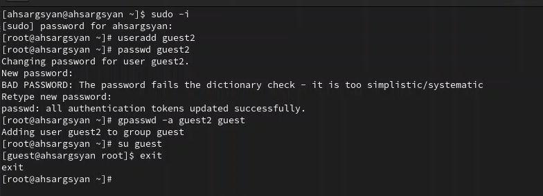

---
## Front matter
lang: ru-RU
title: Презентация лабораторной работы №3
subtitle: Дискреционное разграничение прав в Linux. Два пользователя
author:
  - Саргсян А. Г.
institute:
  - Российский университет дружбы народов, Москва, Россия
date: 20 сентября 2003

## i18n babel
babel-lang: russian
babel-otherlangs: english

## Formatting pdf
toc: false
toc-title: Содержание
slide_level: 2
aspectratio: 169
section-titles: true
theme: metropolis
header-includes:
 - \metroset{progressbar=frametitle,sectionpage=progressbar,numbering=fraction}
 - '\makeatletter'
 - '\beamer@ignorenonframefalse'
 - '\makeatother'
---

# Цели и задачи работы

## Цель лабораторной работы

Получение практических навыков работы в консоли с атрибутами файлов для групп пользователей.

## Задание к лабораторной работе

- Произвести работу в консоли с атрибутами от имени пользователя *guest*;
- Сопоставить опытным путем от пользователя *guest2* таблицы "Установленные права и разрешенные действия" и "Минимальные права для совершения операций".

# Процесс выполнения лабораторной работы

## Теоретический материал 

Есть 3 вида разрешений. Они определяют права пользователя на 3 действия: чтение, запись и выполнение. В Linux эти действия обозначаются вот так:

- **r** — read (чтение) — право просматривать содержимое файла;
- **w** — write (запись) — право изменять содержимое файла;
- **x** — execute (выполнение) — право запускать файл, если это программа или скрипт.

## Теоретический материал 

У каждого файла есть 3 группы пользователей, для которых можно устанавливать права доступа. 

- **owner** (владелец) — отдельный человек, который владеет файлом. Обычно это тот, кто создал файл, но владельцем можно сделать и кого-то другого.
- **group** (группа) — пользователи с общими заданными правами.
- **others** (другие) — все остальные пользователи, не относящиеся к группе и не являющиеся владельцами.

## Выполнение работы

{ #fig:001 width=70% height=70% }

## Выполнение работы

{ #fig:001 width=70% height=70% }

# Выводы по проделанной работе

Рассмотрели задачу о погоне, провели анализ и вывод дифференциальных уравнений, смоделировали ситуацию и нашли точки пересечения катера и лодки.
Выяснили, что в первом случае для достижения цели потребуется пройти значительно меньшее расстояние.

