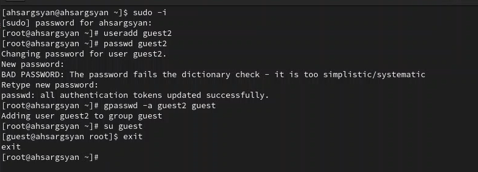
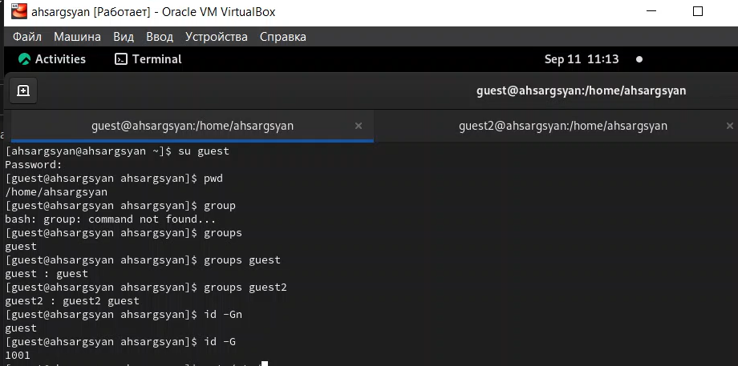

---
## Front matter
title: "Отчёт по лабораторной работе №3"
subtitle: "Дискреционное разграничение прав в Linux. Два пользователя"
author: "Саргсян Арам Грачьяевич"

## Generic otions
lang: ru-RU
toc-title: "Содержание"

## Bibliography
bibliography: bib/cite.bib
csl: pandoc/csl/gost-r-7-0-5-2008-numeric.csl

## Pdf output format
toc: true # Table of contents
toc-depth: 2
lof: true # List of figures
lot: true # List of tables
fontsize: 12pt
linestretch: 1.5
papersize: a4
documentclass: scrreprt
## I18n polyglossia
polyglossia-lang:
  name: russian
  options:
	- spelling=modern
	- babelshorthands=true
polyglossia-otherlangs:
  name: english
## I18n babel
babel-lang: russian
babel-otherlangs: english
## Fonts
mainfont: PT Serif
romanfont: PT Serif
sansfont: PT Sans
monofont: PT Mono
mainfontoptions: Ligatures=TeX
romanfontoptions: Ligatures=TeX
sansfontoptions: Ligatures=TeX,Scale=MatchLowercase
monofontoptions: Scale=MatchLowercase,Scale=0.9
## Biblatex
biblatex: true
biblio-style: "gost-numeric"
biblatexoptions:
  - parentracker=true
  - backend=biber
  - hyperref=auto
  - language=auto
  - autolang=other*
  - citestyle=gost-numeric
## Pandoc-crossref LaTeX customization
figureTitle: "Рис."
tableTitle: "Таблица"
listingTitle: "Листинг"
lofTitle: "Список иллюстраций"
lotTitle: "Список таблиц"
lolTitle: "Листинги"
## Misc options
indent: true
header-includes:
  - \usepackage{indentfirst}
  - \usepackage{float} # keep figures where there are in the text
  - \floatplacement{figure}{H} # keep figures where there are in the text
---

# Цель работы

Получение практических навыков работы в консоли с атрибутами файлов для групп пользователей.

# Задание

- Произвести работу в консоли с атрибутами от имени пользователя *guest*;
- Сотавить опытным путем от пользователя *guest2* таблицы "Установленные права и разрешенные действия" и "Минимальные права для совершения операций".

# Теоретическое введение

В данной лабораторной работе нам предстоит поработать с правами доступа файлов и директорий. **Права доступа** определяют, какие действия конкретный пользователь может или не может совершать с определенным файлами и каталогами.

Есть 3 вида разрешений. Они определяют права пользователя на 3 действия: чтение, запись и выполнение. В Linux эти действия обозначаются вот так:

- **r** — read (чтение) — право просматривать содержимое файла;
- **w** — write (запись) — право изменять содержимое файла;
- **x** — execute (выполнение) — право запускать файл, если это программа или скрипт.

У каждого файла есть 3 группы пользователей, для которых можно устанавливать права доступа. 

- **owner** (владелец) — отдельный человек, который владеет файлом. Обычно это тот, кто создал файл, но владельцем можно сделать и кого-то другого.
- **group** (группа) — пользователи с общими заданными правами.
- **others** (другие) — все остальные пользователи, не относящиеся к группе и не являющиеся владельцами.[@01] 

Чтобы увидеть текущие назначения владельца, нужно использовать команду ```ls -l```. Эта команда показывает пользователя и группу-владельца.

Чтобы применить соответствующие разрешения, первое, что нужно учитывать, это владение. Для этого есть команда ```chown```.[@02]

Для того, чтобы позволить обычным пользователям выполнять программы от имени суперпользователя без знания его пароля была придумана такая вещь, как SUID и SGID биты. Рассмотрим эти полномочия подробнее.

- **SUID** - если этот бит установлен, то при выполнении программы, id пользователя, от которого она запущена заменяется на id владельца файла. Фактически, это позволяет обычным пользователям запускать программы от имени суперпользователя;
- **SGID** - этот флаг работает аналогичным образом, только разница в том, что пользователь считается членом группы, с которой связан файл, а не групп, к которым он действительно принадлежит. Если SGID флаг установлен на каталог, все файлы, созданные в нем, будут связаны с группой каталога, а не пользователя. Такое поведение используется для организации общих папок;
- **Sticky-bit** - этот бит тоже используется для создания общих папок. Если он установлен, то пользователи могут только создавать, читать и выполнять файлы, но не могут удалять файлы, принадлежащие другим пользователям.[@03]


# Выполнение работы

1. В предыдущей работе в установленной ОС создал учетную запись пользователя guest и задали пароль для пользователя (используя учетную запись администратора) и зашли в эту учетную запись. Аналогично создали второго пользователя guest2 и выполнили вход в эту учетную запись. Добавил пользователя guest2 в группу guest (@fig:001) 

{ #fig:001 width=70% height=70% }

2. Выполнил вход в две учетные записи guest guest2 на разных консолях. Для обоих пользователей командой Pwd определили директорию, в которой находимся. Сравнили ее с приглашением командой строки. Уточнили имя нашего пользователя, его группу, кто входит в нее и к каким группам принадлежит он сам. Определили командами groups guest и groups guest2, в какие группы входят пользователи guest и guest2. Сравнили выводы команды groups с выводом команд id –Gn и id –G. (@fig:002)

{ #fig:002 width=70% height=70% }

3. После снятия атрибутов заполнил таблицу [-@tbl:rig-act]

Обозначения в таблице:

(1) Создание файла
(2) Удаление файла
(3) Запись в файл
(4) Чтение файла
(5) Смена директории
(6) Просмотр файлов в директории
(7) Переименование файл
(8) Смена атрибутов файла

: Установленные права и разрешённые действия для групп {#tbl:rig-act}

|Права директории|Права файла|1|2|3|4|5|6|7|8|
|------------------|-------------|-------|-----|------|-------|------------|-----------|---------|------------|
|```---------``` (000)|```---------``` (000)| - | - | - | - | - | - | - | - |
|```---------``` (000)|```-----x---``` (010)| - | - | - | - | - | - | - | - |
|```---------``` (000)|```----w----``` (020)| - | - | - | - | - | - | - | - |
|```---------``` (000)|```----wx---``` (030)| - | - | - | - | - | - | - | - |
|```---------``` (000)|```---r-----``` (040)| - | - | - | - | - | - | - | - |
|```---------``` (000)|```---r-x---``` (050)| - | - | - | - | - | - | - | - |
|```---------``` (000)|```---rw----``` (060)| - | - | - | - | - | - | - | - |
|```---------``` (000)|```---rwx---``` (070)| - | - | - | - | - | - | - | - |
|```-----x---``` (010)|```---------``` (000)| - | - | - | - | + | - | - | - |
|```-----x---``` (010)|```-----x---``` (010)| - | - | - | - | + | - | - | - |
|```-----x---``` (010)|```----w----``` (020)| - | - | + | - | + | - | - | - |
|```-----x---``` (010)|```----wx---``` (030)| - | - | + | - | + | - | - | - |
|```-----x---``` (010)|```---r-----``` (040)| - | - | - | + | + | - | - | + |
|```-----x---``` (010)|```---r-x---``` (050)| - | - | - | + | + | - | - | + |
|```-----x---``` (010)|```---rw----``` (060)| - | - | + | + | + | - | - | + |
|```-----x---``` (010)|```---rwx---``` (070)| - | - | + | + | + | - | - | + |
|```----w----``` (020)|```---------``` (000)| - | - | - | - | - | - | - | - |
|```----w----``` (020)|```-----x---``` (010)| - | - | - | - | - | - | - | - |
|```----w----``` (020)|```----w----``` (020)| - | - | - | - | - | - | - | - |
|```----w----``` (020)|```----wx---``` (030)| - | - | - | - | - | - | - | - |
|```----w----``` (020)|```---r-----``` (040)| - | - | - | - | - | - | - | - |
|```----w----``` (020)|```---r-x---``` (050)| - | - | - | - | - | - | - | - |
|```----w----``` (020)|```---rw----``` (060)| - | - | - | - | - | - | - | - |
|```----w----``` (020)|```---rwx---``` (070)| - | - | - | - | - | - | - | - |
|```----wx---``` (030)|```---------``` (000)| + | + | - | - | + | - | + | - |
|```----wx---``` (030)|```-----x---``` (010)| + | + | - | - | + | - | + | - |
|```----wx---``` (030)|```----w----``` (020)| + | + | + | - | + | - | + | - |
|```----wx---``` (030)|```----wx---``` (030)| + | + | + | - | + | - | + | - |
|```----wx---``` (030)|```---r-----``` (040)| + | + | - | + | + | - | + | + |
|```----wx---``` (030)|```---r-x---``` (050)| + | + | - | + | + | - | + | + |
|```----wx---``` (030)|```---rw----``` (060)| + | + | + | + | + | - | + | + |
|```----wx---``` (030)|```---rwx---``` (070)| + | + | + | + | + | - | + | + |
|```---r-----``` (040)|```---------``` (000)| - | - | - | - | - | + | - | - |
|```---r-----``` (040)|```-----x---``` (010)| - | - | - | - | - | + | - | - |
|```---r-----``` (040)|```----w----``` (020)| - | - | - | - | - | + | - | - |
|```---r-----``` (040)|```----wx---``` (030)| - | - | - | - | - | + | - | - |
|```---r-----``` (040)|```---r-----``` (040)| - | - | - | - | - | + | - | - |
|```---r-----``` (040)|```---r-x---``` (050)| - | - | - | - | - | + | - | - |
|```---r-----``` (040)|```---rw----``` (060)| - | - | - | - | - | + | - | - |
|```---r-----``` (040)|```---rwx---``` (070)| - | - | - | - | - | + | - | - |
|```---r-x---``` (050)|```---------``` (000)| - | - | - | - | + | + | - | - |
|```---r-x---``` (050)|```-----x---``` (010)| - | - | - | - | + | + | - | - |
|```---r-x---``` (050)|```----w----``` (020)| - | - | + | - | + | + | - | - |
|```---r-x---``` (050)|```----wx---``` (030)| - | - | + | - | + | + | - | - |
|```---r-x---``` (050)|```---r-----``` (040)| - | - | - | + | + | + | - | + |
|```---r-x---``` (050)|```---r-x---``` (050)| - | - | - | + | + | + | - | + |
|```---r-x---``` (050)|```---rw----``` (060)| - | - | + | + | + | + | - | + |
|```---r-x---``` (050)|```---rwx---``` (070)| - | - | + | + | + | + | - | + |
|```---rw----``` (060)|```---------``` (000)| - | - | - | - | - | + | - | - |
|```---rw----``` (060)|```-----x---``` (010)| - | - | - | - | - | + | - | - |
|```---rw----``` (060)|```----w----``` (020)| - | - | - | - | - | + | - | - |
|```---rw----``` (060)|```----wx---``` (030)| - | - | - | - | - | + | - | - |
|```---rw----``` (060)|```---r-----``` (040)| - | - | - | - | - | + | - | - |
|```---rw----``` (060)|```---r-x---``` (050)| - | - | - | - | - | + | - | - |
|```---rw----``` (060)|```---rw----``` (060)| - | - | - | - | - | + | - | - |
|```---rw----``` (060)|```---rwx---``` (070)| - | - | - | - | - | + | - | - |
|```---rwx---``` (070)|```---------``` (000)| + | + | - | - | + | + | + | - |
|```---rwx---``` (070)|```-----x---``` (010)| + | + | - | - | + | + | + | - |
|```---rwx---``` (070)|```----w----``` (020)| + | + | + | - | + | + | + | - |
|```---rwx---``` (070)|```----wx---``` (030)| + | + | + | - | + | + | + | - |
|```---rwx---``` (070)|```---r-----``` (040)| + | + | - | + | + | + | + | + |
|```---rwx---``` (070)|```---r-x---``` (050)| + | + | - | + | + | + | + | + |
|```---rwx---``` (070)|```---rw----``` (060)| + | + | + | + | + | + | + | + |
|```---rwx---``` (070)|```---rwx---``` (070)| + | + | + | + | + | + | + | + |


На основании заполненной таблицы я определил те или иные минимально необходимые права для выполнения пользователем guest2 операций внутри директории dir1 
и заполнила таблицу [-@tbl:min-rig]. Для заполнения последних двух строк опытным путем проверил минимальные права для создания и удаления поддиректории.

: Минимальные права для совершения операций {#tbl:min-rig}

|        Операция        | Права на директорию | Права на файл |
|------------------------|---------------------------------|---------------------------|
|     Создание файла     |           ```d----wx--- (030)```      |      ```---------- (000)```     |	    
|     Удаление файла     |           ```d----wx--- (030)```      |      ```---------- (000)```     |
|      Чтение файла      |           ```d-----x--- (010)```      |      ```----r----- (040)```     |
|      Запись в файл     |           ```d-----x--- (010)```      |      ```-----w---- (020)```     |
|  Переименование файла  |           ```d----wx--- (030)```      |      ```---------- (000)```     |
| Создание поддиректории |           ```d----wx--- (030)```      |      ```---------- (000)```     |
| Удаление поддиректории |           ```d----wx--- (030)```      |      ```---------- (000)```     |

Сравнивая таблицу 3.1. с такой же таблицей из предыдущей лабораторной работы, могу сказать, что они одинаковы. Единственное различие только в том, что в предыдущий раз я присваивала права владельцу, а в этот раз группе.

# Выводы

В ходе выполнения работы, мы приобрели практические навыки работы в консоли с атрибутами файлов для групп пользователей.

# Список литературы{.unnumbered}

::: {#refs}
:::
