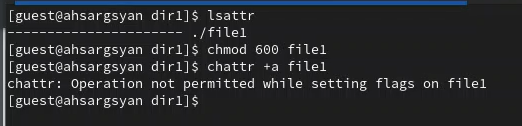
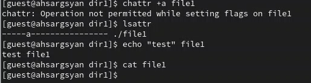
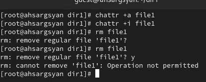

---
## Front matter
lang: ru-RU
title: Лабораторная работа №4
subtitle: Дискреционное
разграничение прав в Linux. Исследование
влияния дополнительных атрибутов
author:
  - Саргсян А. Г.
institute:
  - Российский университет дружбы народов, Москва, Россия
date: 27 сентября 2023

## i18n babel
babel-lang: russian
babel-otherlangs: english

## Formatting pdf
toc: false
toc-title: Содержание
slide_level: 2
aspectratio: 169
section-titles: true
theme: metropolis
header-includes:
 - \metroset{progressbar=frametitle,sectionpage=progressbar,numbering=fraction}
 - '\makeatletter'
 - '\beamer@ignorenonframefalse'
 - '\makeatother'
---

# Цели и задачи работы

## Цель лабораторной работы

Получение практических навыков работы в консоли с расширенными
атрибутами файлов.

## Задание к лабораторной работе

- Произвести работу в консоли с атрибутами от имени пользователя *guest*;
- Изучить расширенные атрибуты a и i.

# Процесс выполнения лабораторной работы

## Выполнение работы

{ #fig:001 width=70% height=70% }

## Выполнение работы

{ #fig:001 width=70% height=70% }

## Выполнение работы

{ #fig:001 width=70% height=70% }

# Выводы по проделанной работе

Я получил практические навыки по работе в консоли с расширенными
атрибутами файлов.

