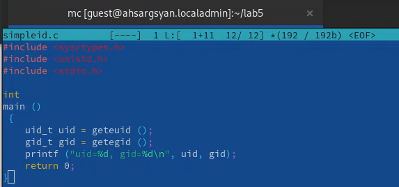
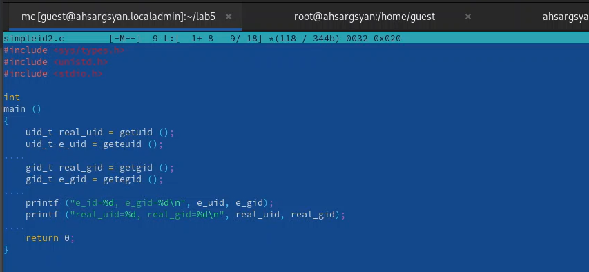
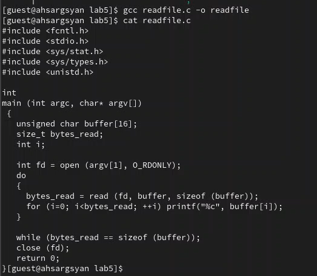

---
## Front matter
lang: ru-RU
title: Лабораторная работа №5
subtitle: Дискреционное разграничение прав в Linux. Расширенные атрибуты
author:
  - Саргсян А. Г.
institute:
  - Российский университет дружбы народов, Москва, Россия
date: 4 октября 2023

## i18n babel
babel-lang: russian
babel-otherlangs: english

## Formatting pdf
toc: false
toc-title: Содержание
slide_level: 2
aspectratio: 169
section-titles: true
theme: metropolis
header-includes:
 - \metroset{progressbar=frametitle,sectionpage=progressbar,numbering=fraction}
 - '\makeatletter'
 - '\beamer@ignorenonframefalse'
 - '\makeatother'
---

# Цели и задачи работы

Изучение механизмов изменения идентификаторов, применения
SetUID- и Sticky-битов. Получение практических навыков работы в консоли с дополнительными атрибутами. Рассмотрение работы механизма
смены идентификатора процессов пользователей, а также влияние бита
Sticky на запись и удаление файлов.

# Процесс выполнения лабораторной работы

## Выполнение работы

{#fig:001 width=70%}

## Выполнение работы

{#fig:001 width=70%}

## Выполнение работы

{#fig:001 width=70%}

# Выводы по проделанной работе

Я изучил механизмы изменения идентификаторов, применения SetUID- и Sticky-битов, получил практические навыки работы в консоли с дополнительными атрибутами. Рассмотрение работы механизма
смены идентификатора процессов пользователей, а также влияние бита Sticky на запись и удаление файлов.

