---
## Front matter
title: "Лабораторная работа №5"
author: "Саргсян Арам Грачьяевич"

## Generic otions
lang: ru-RU
toc-title: "Содержание"

## Bibliography
bibliography: bib/cite.bib
csl: pandoc/csl/gost-r-7-0-5-2008-numeric.csl

## Pdf output format
toc: true # Table of contents
toc-depth: 2
lof: true # List of figures
lot: true # List of tables
fontsize: 12pt
linestretch: 1.5
papersize: a4
documentclass: scrreprt
## I18n polyglossia
polyglossia-lang:
  name: russian
  options:
	- spelling=modern
	- babelshorthands=true
polyglossia-otherlangs:
  name: english
## I18n babel
babel-lang: russian
babel-otherlangs: english
## Fonts
mainfont: PT Serif
romanfont: PT Serif
sansfont: PT Sans
monofont: PT Mono
mainfontoptions: Ligatures=TeX
romanfontoptions: Ligatures=TeX
sansfontoptions: Ligatures=TeX,Scale=MatchLowercase
monofontoptions: Scale=MatchLowercase,Scale=0.9
## Biblatex
biblatex: true
biblio-style: "gost-numeric"
biblatexoptions:
  - parentracker=true
  - backend=biber
  - hyperref=auto
  - language=auto
  - autolang=other*
  - citestyle=gost-numeric
## Pandoc-crossref LaTeX customization
figureTitle: "Рис."
tableTitle: "Таблица"
listingTitle: "Листинг"
lofTitle: "Список иллюстраций"
lotTitle: "Список таблиц"
lolTitle: "Листинги"
## Misc options
indent: true
header-includes:
  - \usepackage{indentfirst}
  - \usepackage{float} # keep figures where there are in the text
  - \floatplacement{figure}{H} # keep figures where there are in the text
---

# Цель работы

Изучение механизмов изменения идентификаторов, применения
SetUID- и Sticky-битов. Получение практических навыков работы в консоли с дополнительными атрибутами. Рассмотрение работы механизма
смены идентификатора процессов пользователей, а также влияние бита
Sticky на запись и удаление файлов.

# Теоретическое введение

Есть 3 вида разрешений. Они определяют права пользователя на 3 действия: чтение, запись и выполнение. В Linux эти действия обозначаются вот так:

- **r** — read (чтение) — право просматривать содержимое файла;
- **w** — write (запись) — право изменять содержимое файла;
- **x** — execute (выполнение) — право запускать файл, если это программа или скрипт.

У каждого файла есть 3 группы пользователей, для которых можно устанавливать права доступа. 

- **owner** (владелец) — отдельный человек, который владеет файлом. Обычно это тот, кто создал файл, но владельцем можно сделать и кого-то другого.
- **group** (группа) — пользователи с общими заданными правами.
- **others** (другие) — все остальные пользователи, не относящиеся к группе и не являющиеся владельцами[@01]. 

Чтобы увидеть текущие назначения владельца, нужно использовать команду ```ls -l```. Эта команда показывает пользователя и группу-владельца.

Чтобы применить соответствующие разрешения, первое, что нужно учитывать, это владение. Для этого есть команда ```chown```[@02].

Для того, чтобы позволить обычным пользователям выполнять программы от имени суперпользователя без знания его пароля была придумана такая вещь, как SUID и SGID биты. Рассмотрим эти полномочия подробнее.

- **SUID** - если этот бит установлен, то при выполнении программы, id пользователя, от которого она запущена заменяется на id владельца файла. Фактически, это позволяет обычным пользователям запускать программы от имени суперпользователя;
- **SGID** - этот флаг работает аналогичным образом, только разница в том, что пользователь считается членом группы, с которой связан файл, а не групп, к которым он действительно принадлежит. Если SGID флаг установлен на каталог, все файлы, созданные в нем, будут связаны с группой каталога, а не пользователя. Такое поведение используется для организации общих папок;
- **Sticky-bit** - этот бит тоже используется для создания общих папок. Если он установлен, то пользователи могут только создавать, читать и выполнять файлы, но не могут удалять файлы, принадлежащие другим пользователям[@03].

# Выполнение лабораторной работы

1. От имени пользователя guest создал файл simpleid (рис. @fig:001, @fig:002).

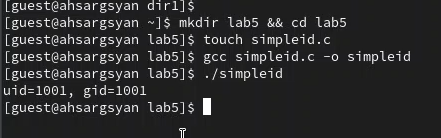{#fig:001 width=70%}

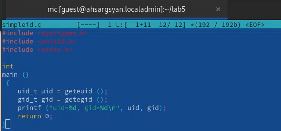{#fig:002 width=70%}

2. Cоздал файл simpleid2 (рис. @fig:003, @fig:004).

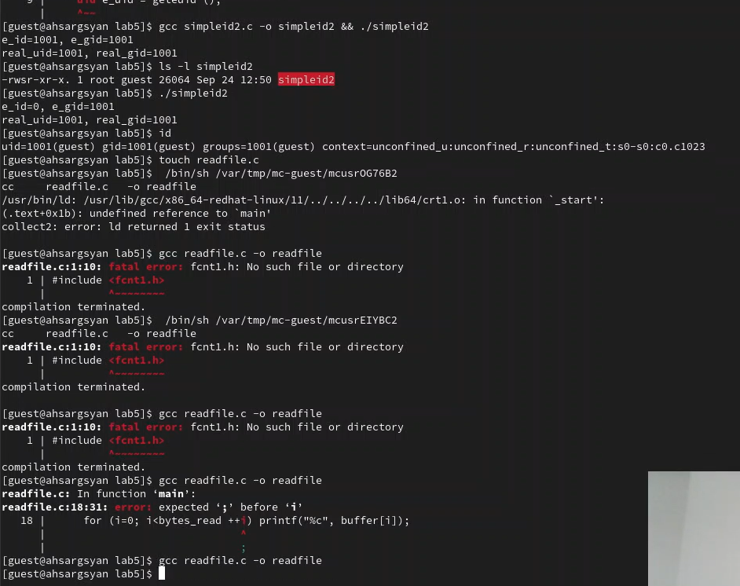{#fig:003 width=70%}

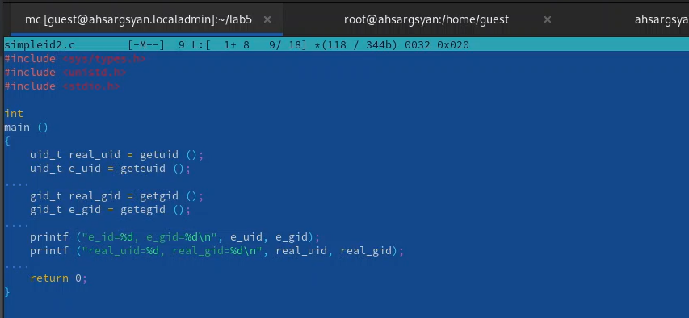{#fig:004 width=70%}

3. От имени суперпользователя выполнил нужные команды (рис. @fig:005).

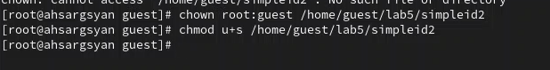{#fig:005 width=70%}

4. Создал readfile.c, изменил права доступа (рис. @fig:006, @fig:007).

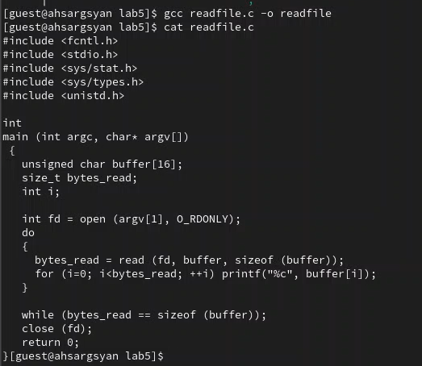{#fig:006 width=70%}

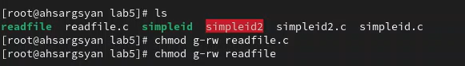{#fig:007 width=70%}

5. Прочитал с помощью readfile etc/shadow (рис. @fig:008).

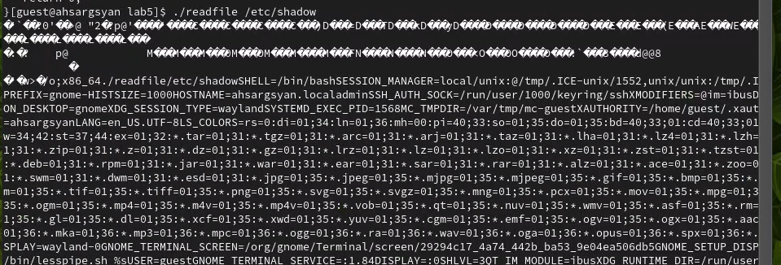{#fig:008 width=70%}

6. Исследовал sticky bit (рис. @fig:009, @fig:010, @fig:011).

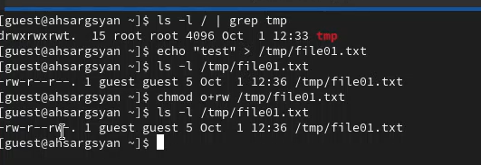{#fig:009 width=70%} 

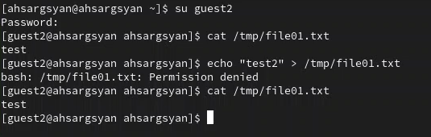{#fig:010 width=70%} 

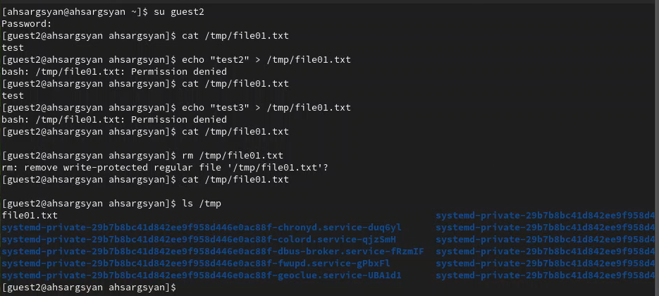{#fig:011 width=70%} 

# Выводы

Я изучил механизмы изменения идентификаторов, применения SetUID- и Sticky-битов, получил практические навыки работы в консоли с дополнительными атрибутами. Рассмотрение работы механизма
смены идентификатора процессов пользователей, а также влияние бита Sticky на запись и удаление файлов.

# Список литературы{.unnumbered}

::: {#refs}
:::
