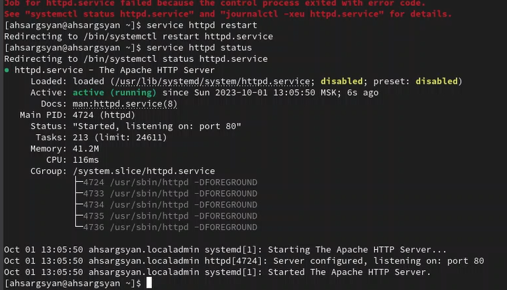
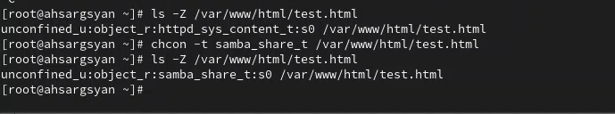
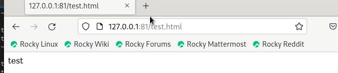

---
## Front matter
lang: ru-RU
title: Презентация по лабораторной работе №6
subtitle: Мандатное разграничение прав в Linux
author:
  - Саргсян А. Г.
institute:
  - Российский университет дружбы народов, Москва, Россия
date: 08 октября 2023

## i18n babel
babel-lang: russian
babel-otherlangs: english

## Formatting pdf
toc: false
toc-title: Содержание
slide_level: 2
aspectratio: 169
section-titles: true
theme: metropolis
header-includes:
 - \metroset{progressbar=frametitle,sectionpage=progressbar,numbering=fraction}
 - '\makeatletter'
 - '\beamer@ignorenonframefalse'
 - '\makeatother'
---

# Цель работы

Развить навыки администрирования ОС Linux. Получить первое практическое знакомство с технологией SELinux.
Проверить работу SELinux на практике совместно с веб-сервером Apache.

# Теоретическое введение

## SELinux
SELinux (Security-Enhanced Linux) - это набор обязательных контролов доступа (MAC), разработанных для улучшения безопасности операционных систем на базе ядра Linux. SELinux предоставляет дополнительные уровни безопасности, которые работают в дополнение к стандартным системам управления доступом, таким как управление правами доступа (DAC - discretionary access control).

Основные особенности SELinux:

1. Принудительный контроль доступа (MAC):

2. Политики безопасности

3. Роли и контексты

4. Проверка соблюдения политик

5. Гибкость настройки

6. Аудит и журналирование

## Apache

Apache, также известный как Apache HTTP Server, - это свободный и открытый веб-сервер, разработанный Apache Software Foundation. Этот веб-сервер является одним из самых популярных и широко используемых в мире, и он играет ключевую роль в инфраструктуре множества веб-сайтов и приложений. Вот некоторые основные характеристики и функции Apache:

1. Сервер статических и динамических контентов

2. Модульная архитектура

3. Открытое ПО

4. Поддержка множества протоколов

5. Виртуальные хосты

6. Безопасность

7. Логирование

# Выполнение работы 

## Запуск apache

{#fig:004 width=70%}

## Изменение контеста безопасности

{#fig:010 width=70%}

## Открытие файла через 81 порт

{#fig:015 width=70%}

