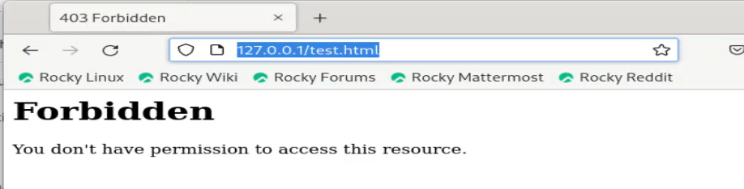

---
## Front matter
title: "Отчёт по лабораторной работе №6"
subtitle: "Мандатное разграничение прав в Linux"
author: "Саргсян Арам Грачьяевич"

## Generic otions
lang: ru-RU
toc-title: "Содержание"

## Bibliography
bibliography: bib/cite.bib
csl: pandoc/csl/gost-r-7-0-5-2008-numeric.csl

## Pdf output format
toc: true # Table of contents
toc-depth: 2
lof: true # List of figures
lot: true # List of tables
fontsize: 12pt
linestretch: 1.5
papersize: a4
documentclass: scrreprt
## I18n polyglossia
polyglossia-lang:
  name: russian
  options:
	- spelling=modern
	- babelshorthands=true
polyglossia-otherlangs:
  name: english
## I18n babel
babel-lang: russian
babel-otherlangs: english
## Fonts
mainfont: PT Serif
romanfont: PT Serif
sansfont: PT Sans
monofont: PT Mono
mainfontoptions: Ligatures=TeX
romanfontoptions: Ligatures=TeX
sansfontoptions: Ligatures=TeX,Scale=MatchLowercase
monofontoptions: Scale=MatchLowercase,Scale=0.9
## Biblatex
biblatex: true
biblio-style: "gost-numeric"
biblatexoptions:
  - parentracker=true
  - backend=biber
  - hyperref=auto
  - language=auto
  - autolang=other*
  - citestyle=gost-numeric
## Pandoc-crossref LaTeX customization
figureTitle: "Рис."
tableTitle: "Таблица"
listingTitle: "Листинг"
lofTitle: "Список иллюстраций"
lotTitle: "Список таблиц"
lolTitle: "Листинги"
## Misc options
indent: true
header-includes:
  - \usepackage{indentfirst}
  - \usepackage{float} # keep figures where there are in the text
  - \floatplacement{figure}{H} # keep figures where there are in the text
---

# Цель работы

Развить навыки администрирования ОС Linux. Получить первое практическое знакомство с технологией SELinux.
Проверить работу SELinux на практике совместно с веб-сервером Apache.

# Теоретическое введение

## SELinux
SELinux (Security-Enhanced Linux) - это набор обязательных контролов доступа (MAC), разработанных для улучшения безопасности операционных систем на базе ядра Linux. SELinux предоставляет дополнительные уровни безопасности, которые работают в дополнение к стандартным системам управления доступом, таким как управление правами доступа (DAC - discretionary access control).

Основные особенности SELinux:

1. Принудительный контроль доступа (MAC): SELinux предоставляет механизм, который определяет, к каким ресурсам и операциям пользователи и процессы имеют доступ. В отличие от системы управления доступом на основе прав доступа (DAC), где пользователи могут управлять своими файлами и процессами, SELinux предписывает жесткие правила доступа на уровне ядра.

2. Политики безопасности: SELinux использует политики безопасности, определяющие, какие действия разрешены для различных объектов и субъектов (пользователей и процессов). Политики могут быть настроены и настраиваться в зависимости от потребностей системы.

3. Роли и контексты: В SELinux каждому процессу и ресурсу назначаются контексты безопасности, которые определяют его роль и права доступа. Это помогает изолировать процессы и уменьшает риск распространения атак.

4. Проверка соблюдения политик: SELinux постоянно проверяет соблюдение политик безопасности и блокирует доступ, который нарушает эти политики. Это повышает уровень безопасности, предотвращая многие типичные уязвимости.

5. Гибкость настройки: SELinux позволяет администраторам настраивать политики безопасности под конкретные потребности системы, создавать собственные политики и определять, какие действия разрешены и какие запрещены.

6. Аудит и журналирование: SELinux обеспечивает детализированный аудит и журналирование событий, что позволяет администраторам исследовать инциденты безопасности и выявлять аномалии.

SELinux является мощным инструментом для улучшения безопасности Linux-систем, но его конфигурация может быть сложной и требовать понимания принципов безопасности. В большинстве дистрибутивов Linux SELinux предоставляется как опция, и его активация и настройка зависят от конкретных потребностей системы и уровня безопасности [@01].

## Apache

Apache, также известный как Apache HTTP Server, - это свободный и открытый веб-сервер, разработанный Apache Software Foundation. Этот веб-сервер является одним из самых популярных и широко используемых в мире, и он играет ключевую роль в инфраструктуре множества веб-сайтов и приложений. Вот некоторые основные характеристики и функции Apache:

1. Сервер статических и динамических контентов: Apache способен обслуживать как статические веб-страницы, так и динамические, включая страницы, создаваемые с использованием языков программирования, таких как PHP, Python, и Ruby.

2. Модульная архитектура: Apache использует модульную архитектуру, которая позволяет добавлять и настраивать разнообразные функциональные возможности, такие как аутентификация, шифрование, сжатие и многое другое с помощью модулей.

3. Открытое ПО: Apache является свободным программным обеспечением с открытым исходным кодом, что означает, что его исходный код доступен для общественности для просмотра, изменения и распространения в соответствии с лицензией Apache.

4. Поддержка множества протоколов: Apache поддерживает множество сетевых протоколов, включая HTTP, HTTPS (через модуль SSL/TLS), и другие протоколы, что делает его универсальным инструментом для обслуживания разнообразных веб-приложений.

5. Виртуальные хосты: Apache поддерживает конфигурацию виртуальных хостов, что позволяет хостить несколько сайтов на одном сервере с разными доменными именами и настройками.

6. Безопасность: Apache предоставляет множество механизмов для обеспечения безопасности, включая возможность настройки правил доступа, аутентификации и шифрования данных.

7. Логирование: Apache генерирует лог-файлы, которые записывают информацию о запросах, ошибках и активности сервера, что полезно для мониторинга и анализа.

8. Apache используется множеством организаций и индивидуальных разработчиков для развертывания веб-сайтов и веб-приложений на серверах Linux и других операционных системах. Благодаря обширному сообществу и богатой документации, Apache остается одним из наиболее надежных и гибких веб-серверов [@02].

# Выполнение лабораторной работы

1. Установил веб-сервис apache для дальнейшей работы (рис. @fig:001).

{#fig:001 width=70%}

2. В конфигурационном файле /etc/httpd/httpd.conf задал параметр ServerName (рис. @fig:002).

{#fig:002 width=70%}

3. Вошел в систему с полученными учётными данными и убедился, что
SELinux работает в режиме enforcing политики targeted с помощью команд getenforce и sestatus. Запустил веб-сервис (рис. @fig:003, @fig:004). 

{#fig:003 width=70%}

{#fig:004 width=70%}

4. Определил его контест безопасности (рис. @fig:005)

{#fig:005 width=70%}

5. Посмотрел текущее состояние переключателей SELinux (рис. @fig:006)

{#fig:006 width=70%}

6. Посмотрел статистику по политике с помощью команды seinfo (рис. @fig:007)

{#fig:007 width=70%}

7. Определил тип файлов и поддиректорий, находящихся в директории
/var/www, определил тип файлов, находящихся в директории /var/www/html, определил круг пользователей, которым разрешено создание файлов в
директории /var/www/html. Создал от имени суперпользователя html-файл test.html. Проверил контекст созданного вами файла. Занесите в отчёт контекст,
присваиваемый по умолчанию вновь созданным файлам в директории /var/www/html. Обратился к файлу через веб-сервер (рис. @fig:008, @fig:009)

{#fig:008 width=70%}

{#fig:009 width=70%}

8. Изменил контекст файла /var/www/html/test.html с
httpd_sys_content_t на любой другой, к которому процесс httpd не
должен иметь доступа, попробовал ещё раз получить доступ к файлу через веб-сервер (рис. @fig:010, @fig:011).

{#fig:010 width=70%}

{#fig:011 width=70%}

9. Просмотрел log-файлы веб-сервера Apache (рис. @fig:012)

{#fig:012 width=70%}

10. Открыл файл через 81 порт (рис. @fig:013, @fig:014, @fig:015)

{#fig:013 width=70%}

{#fig:014 width=70%}

{#fig:015 width=70%}

# Выводы

Я развил навыки администрирования ОС Linux. Получил первое практическое знакомство с технологией SELinux, а также проверил работу SELinux на практике совместно с веб-сервером Apache.

# Список литературы{.unnumbered}

::: {#refs}
:::
