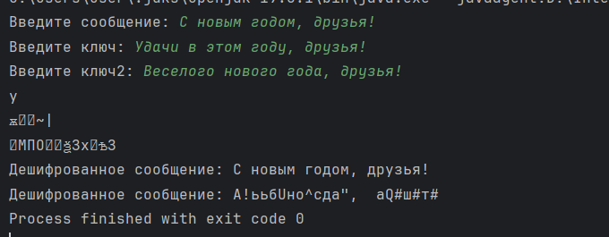

---
## Front matter
title: "Отчёт по лабораторной работе №7"
subtitle: "Элементы криптографии. Однократное гаммирование"
author: "Саргсян Арам Грачьяевич"

## Generic otions
lang: ru-RU
toc-title: "Содержание"

## Bibliography
bibliography: bib/cite.bib
csl: pandoc/csl/gost-r-7-0-5-2008-numeric.csl

## Pdf output format
toc: true # Table of contents
toc-depth: 2
lof: true # List of figures
fontsize: 12pt
linestretch: 1.5
papersize: a4
documentclass: scrreprt
## I18n polyglossia
polyglossia-lang:
  name: russian
  options:
	- spelling=modern
	- babelshorthands=true
polyglossia-otherlangs:
  name: english
## I18n babel
babel-lang: russian
babel-otherlangs: english
## Fonts
mainfont: PT Serif
romanfont: PT Serif
sansfont: PT Sans
monofont: PT Mono
mainfontoptions: Ligatures=TeX
romanfontoptions: Ligatures=TeX
sansfontoptions: Ligatures=TeX,Scale=MatchLowercase
monofontoptions: Scale=MatchLowercase,Scale=0.9
## Biblatex
biblatex: true
biblio-style: "gost-numeric"
biblatexoptions:
  - parentracker=true
  - backend=biber
  - hyperref=auto
  - language=auto
  - autolang=other*
  - citestyle=gost-numeric
## Pandoc-crossref LaTeX customization
figureTitle: "Рис."
tableTitle: "Таблица"
listingTitle: "Листинг"
lofTitle: "Список иллюстраций"
lotTitle: "Список таблиц"
lolTitle: "Листинги"
## Misc options
indent: true
header-includes:
  - \usepackage{indentfirst}
  - \usepackage{float} # keep figures where there are in the text
  - \floatplacement{figure}{H} # keep figures where there are in the text
---

# Цель работы

Освоить на практике применение режима однократного гаммирования.

# Задание

Нужно подобрать ключ, чтобы получить сообщение «С Новым Годом,
друзья!». Требуется разработать приложение, позволяющее шифровать и
дешифровать данные в режиме однократного гаммирования. Приложение
должно:
1. Определить вид шифротекста при известном ключе и известном открытом тексте.
2. Определить ключ, с помощью которого шифротекст может быть преобразован в некоторый фрагмент текста, представляющий собой один из
возможных вариантов прочтения открытого текста.

# Теоретическое введение

Гаммирование представляет собой наложение (снятие) на открытые (зашифрованные) данные последовательности элементов других данных, полученной с помощью некоторого криптографического алгоритма, для получения зашифрованных (открытых) данных. Иными словами, наложение
гаммы — это сложение её элементов с элементами открытого (закрытого)
текста по некоторому фиксированному модулю, значение которого представляет собой известную часть алгоритма шифрования.
В соответствии с теорией криптоанализа, если в методе шифрования используется однократная вероятностная гамма (однократное гаммирование)
той же длины, что и подлежащий сокрытию текст, то текст нельзя раскрыть.
Даже при раскрытии части последовательности гаммы нельзя получить информацию о всём скрываемом тексте.
Наложение гаммы по сути представляет собой выполнение операции
сложения по модулю 2 (XOR) (обозначаемая знаком ⊕) между элементами
гаммы и элементами подлежащего сокрытию текста. Напомним, как работает операция XOR над битами: 0 ⊕ 0 = 0, 0 ⊕ 1 = 1, 1 ⊕ 0 = 1, 1 ⊕ 1 = 0.
Такой метод шифрования является симметричным, так как двойное прибавление одной и той же величины по модулю 2 восстанавливает исходное значение, а шифрование и расшифрование выполняется одной и той же программой[@1].

# Выполнение лабораторной работы

Написал программу, реализующую данный метод (рис. @fig:001).

{#fig:001 width=70%}


```
import java.util.Scanner;
public class Main {
    private static final Scanner sc = new Scanner(System.in);
    public static String cipher(String message, String key) {
        StringBuilder out = new StringBuilder();
        int length = message.length();
        for (int i = 0; i < length; i++) {
            out.append(((char) (message.charAt(i) ^ key.charAt(i)))); // сложение по модулю
        }
        return out.toString();
    }
    public static void main(String[] args) {
        System.out.print("Введите сообщение: ");
        String input = sc.nextLine();
        System.out.print("Введите ключ: ");
        String key = sc.nextLine();
        System.out.print("Введите ключ2: ");
        String key2 = sc.nextLine();
        while (input.length() !=key.length() || input.length() !=key2.length()){
            System.out.println("Ошибка, введите корректные данные");
            System.out.print("Введите сообщение: ");
            input = sc.nextLine();
            System.out.print("Введите ключ: ");
            key = sc.nextLine();
            System.out.print("Введите ключ2: ");
            key2 = sc.nextLine();
        }

        String cipher = cipher(input, key);
        String decipher = cipher(cipher(input, key), key);
        String decipher2 = cipher(cipher(input, key), key2);
        System.out.printf("Зашифрованное сообщение: %s", cipher);
        System.out.printf("\nДешифрованное сообщение: %s", decipher);
        System.out.printf("\nДешифрованное сообщение: %s", decipher2);
    }
}
```


# Ответы на контрольные вопросы

1. Что означает однократное гаммирование?

  Однократное гаммирование (или потоковое шифрование) - это метод шифрования, при котором каждый символ открытого текста комбинируется с соответствующим символом ключа с использованием операции XOR (исключающее ИЛИ). Это позволяет создать шифротекст, который, в теории, сложно расшифровать без знания правильного ключа.

2. Какие недостатки существуют у однократного гаммирования?

Недостатки однократного гаммирования включают:
  - Одинаковая длина ключа и открытого текста - необходимость генерировать ключи такой же длины, что и открытый текст, что может быть неудобным.
  - Отсутствие аутентификации - однократное гаммирование не предоставляет проверку целостности данных и аутентификации отправителя.
  - Ключевой материал - необходимо генерировать случайные ключи высокого качества для обеспечения безопасности.

3. Какие преимущества имеет однократное гаммирование?
   
   Преимущества однократного гаммирования включают:
   - Высокая стойкость к криптоанализу в теории при правильном использовании.
   - Простота реализации операции XOR.
   - Отсутствие паттернов в шифротексте, которые могли бы использоваться для атак.

4. Почему длина открытого текста должна совпадать с длиной ключа?
    
   Для однократного гаммирования (потокового шифрования) длина ключа должна совпадать с длиной открытого текста, чтобы выполнить операцию XOR между ними. Если длины открытого текста и ключа не совпадают, операция XOR невозможна или требует дополнительных операций, что может сильно ухудшить безопасность шифра.

5. Какая операция используется в режиме однократного гаммирования, назовите её особенности?
    
   В режиме однократного гаммирования используется операция XOR (исключающее ИЛИ). Особенность операции XOR заключается в том, что она возвращает true (1) только в случае, если один из операндов равен true (1), но не оба. Если оба операнда одинаковы (или оба равны 0), результат будет false (0). Это делает XOR удобной для комбинирования символов открытого текста и ключа для создания шифротекста.

6. Как по открытому тексту и ключу получить шифротекст?
   
   Чтобы получить шифротекст по открытому тексту и ключу в режиме однократного гаммирования, каждый символ открытого текста комбинируется с соответствующим символом ключа с использованием операции XOR. Результат этой операции будет шифротекстом.

7. Как по открытому тексту и шифротексту получить ключ?
   
   В однократном гаммировании необходимо знать ключ для расшифровки, и обратное получение ключа из открытого текста и шифротекста в общем случае является сложной задачей. Этот процесс не является стандартной частью схемы однократного гаммирования, и расшифровка обычно требует знания правильного ключа.

8. В чем заключаются необходимые и достаточные условия абсолютной стойкости шифра?
   
   Абсолютная стойкость шифра означает, что шифр не может быть взломан, независимо от доступных вычислительных ресурсов и времени. Однако абсолютная стойкость шифра является идеализированным понятием и в реальности трудно достижима. Некоторые общие условия, которые могут повысить стойкость шифра, включают:
   - Использование ключей максимальной длины.
   - Использование ключей, генерируемых случайным образом.
   - Отсутствие паттернов в шифротексте.
   - Соблюдение математических принципов криптографии.

Однако даже при соблюдении всех этих условий абсолютная стойкость может оставаться недостижимой, так как новые методы атаки всегда могут быть разработаны.


# Выводы

Я на практике освоил применение режима однократного гаммирования.

# Список литературы{.unnumbered}

::: {#refs}
:::
