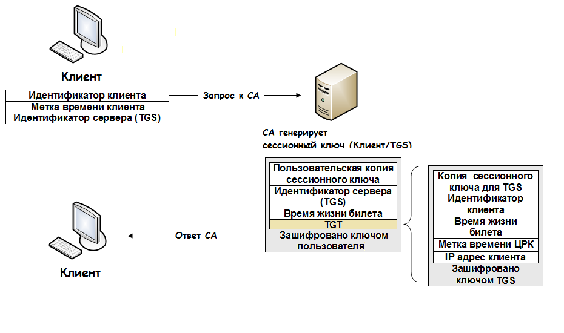

---
## Front matter
lang: ru-RU
title: Презентация по информационной безопасности
subtitle: Простейший шаблон
author:
  - Саргсян А. Г.
institute:
  - Российский университет дружбы народов, Москва, Россия
date: 16 октября 2023

## i18n babel
babel-lang: russian
babel-otherlangs: english

## Formatting pdf
toc: false
toc-title: Содержание
slide_level: 2
aspectratio: 169
section-titles: true
theme: metropolis
header-includes:
 - \metroset{progressbar=frametitle,sectionpage=progressbar,numbering=fraction}
 - '\makeatletter'
 - '\beamer@ignorenonframefalse'
 - '\makeatother'
---

##  Основные понятия и термины

Аутентификация --- это процесс проверки личности пользователя или устройства.

Авторизация --- это процесс определения разрешений и прав доступа, которые пользователь получает после успешной аутентификации.

Основные цели безопасности включают в себя конфиденциальность, целостность и доступность данных.

## История создания

Kerberos --- это сетевой протокол централизованной аутентификации клиентов компьютерных сетей на основе архитектуры клиент-сервер.

Разработан в Массачусетском технологическом институте (MIT) в 1980-х годах.

Первые 3 версии были закрытыми и использовались исключительно в MIT.

##  Основные компоненты

1. Клиент (Client)

2. Ключевой распространитель (Key Distribution Center - KDC)

3. Билет (Ticket)

4. Сервер (Server)

5. Сессионный ключ (Session Key)

## Схема работы протокола

{ #fig:001 width=60% height=60% }

## Преимущества и недостатки 

| Преимущества Kerberos  | Недостатки Kerberos        |
|------------------------|----------------------------|
| 1. Безопасность        		       | 1. Сложность настройки     |
| 2. Централизованное управление               | 2. Зависимость от доверия к KDC  |
| 3. Ограниченное время действия билетов       | 3. Исключение из билетов |
| 4. Интеграция с разными  ОС и приложениями   | 4. Ограничения для мобильных и децентрализованных сетей |

## Применение протокола

1. Корпоративные сети

2. Операционные системы

3. Системы управления доступом

4. Электронная почта и веб-приложения

5. Облачные решения

6. Виртуальные частные сети (VPN)

## Вывод

- Централизованное управление: Kerberos облегчает управление безопасностью в сетях благодаря централизованной аутентификации и распределению ключей.

- Интеграция и распространение: Протокол широко используется в различных областях, от корпоративных сетей до образования, что подчеркивает его универсальность.

- Преимущества и недостатки: Понимание преимуществ и недостатков Kerberos помогает в принятии обоснованных решений о его внедрении.

- Безопасность и конфиденциальность: Kerberos обеспечивает надежную защиту данных и поддерживает высокий стандарт безопасности.

- Применение в различных областях: Протокол Kerberos находит применение в разнообразных отраслях и сферах деятельности, где безопасность играет важную роль.

